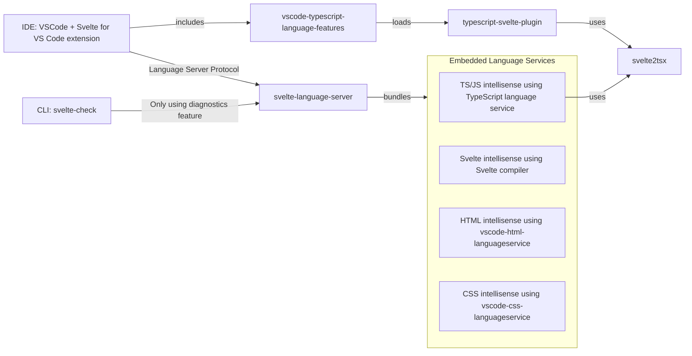

# Contributing to Svelte Language Tools

Svelte Language Tools provides IDE support for Svelte files through the Language Server Protocol (LSP). It powers the [VSCode extension](https://marketplace.visualstudio.com/items?itemName=svelte.svelte-vscode) and enables Svelte support in [numerous other IDEs](https://microsoft.github.io/language-server-protocol/implementors/tools/).

The [Open Source Guides](https://opensource.guide/) website has a collection of resources for individuals, communities, and companies. These resources help people who want to learn how to run and contribute to open source projects. Contributors and people new to open source alike will find the following guides especially useful:

-   [How to Contribute to Open Source](https://opensource.guide/how-to-contribute/)
-   [Building Welcoming Communities](https://opensource.guide/building-community/)

## Get involved

There are many ways to contribute to Svelte Language Tools, and many of them do not involve writing any code. Here's a few ideas to get started:

-   Simply start using Svelte Language Tools in your IDE. Does everything work as expected? If not, we're always looking for improvements. Let us know by [opening an issue](#reporting-new-issues).
-   Look through the [open issues](https://github.com/sveltejs/language-tools/issues). A good starting point would be issues tagged [good first issue](https://github.com/sveltejs/language-tools/issues?q=is%3Aissue+is%3Aopen+label%3A%22good+first+issue%22). Provide workarounds, ask for clarification, or suggest labels. Help triage issues.
-   If you find an issue you would like to fix, [open a pull request](#pull-requests).
-   Read through our [documentation](https://github.com/sveltejs/language-tools/tree/master/docs). If you find anything that is confusing or can be improved, you can make edits by opening a pull request.
-   Take a look at the [features requested](https://github.com/sveltejs/language-tools/labels/enhancement) by others in the community and consider opening a pull request if you see something you want to work on.

Contributions are very welcome. If you think you need help planning your contribution, please reach out to us on [Discord](https://svelte.dev/chat) and let us know you are looking for a bit of help.

## Development

This is a monorepo managed with [`pnpm workspaces`](https://pnpm.io/workspaces/). Install pnpm globally with:

```sh
npm i -g pnpm
```

Clone the repository and install dependencies:

```sh
git clone git@github.com:sveltejs/language-tools.git
cd language-tools
pnpm install
pnpm bootstrap
```

### Building

To build all packages:

```sh
pnpm build
```

To watch for changes:

```sh
pnpm watch
```

### Code structure

#### Packages

-   [`packages/language-server`](packages/language-server) - The language server for Svelte.
-   [`packages/svelte-vscode`](packages/svelte-vscode) - The official VSCode extension for Svelte
-   [`packages/svelte2tsx`](packages/svelte2tsx) - Converts `.svelte` files into legal TypeScript/JSX. Want to see how it's transformed? [Check out this REPL](https://embed.plnkr.co/plunk/JPye9tlsqwMrWHGv?show=preview&autoCloseSidebar)
-   [`packages/svelte-check`](packages/svelte-check) - CLI tool for type checking and diagnostics

#### Key entry points

-   `packages/language-server/src/server.ts` - Language server entry point
-   `packages/language-server/src/plugins/` - Language service plugins (TypeScript, Svelte, CSS, HTML)
-   `packages/svelte2tsx/src/svelte2tsx/index.ts` - Svelte to TSX transformation
-   `packages/svelte-vscode/src/extension.ts` - VSCode extension entry point

#### High Level Overview



More information about the internals can be found [HERE](./docs/internal/overview.md).

### Running tests

Run tests for all packages:

```sh
pnpm test
```

Run tests for a specific package:

```sh
cd packages/[package-name]
pnpm test
```

### Testing in VSCode

To test your changes in VSCode:

1. Open the repository in VSCode
2. Go to the debug panel (Ctrl+Shift+D / Cmd+Shift+D)
3. Select "Run VSCode Extension" from the dropdown
4. Press F5 to launch a new VSCode instance with your changes

This launches a new VSCode window and a watcher for your changes. In this dev window you can choose an existing Svelte project to work against. When you make changes to `svelte-vscode` use the command "Reload Window" in the VSCode command palette to see your changes. When you make changes to `language-server` use the command "Svelte: Restart Language Server". When you make changes to `svelte2tsx`, you first need to run `pnpm build` within its folder, then restart the language server. When you make changes to`typescript-plugin`, you need to first run `pnpm build` within its folder and then use the command "TypeScript: Restart Server".

#### Testing in other editors

For other editors, you'll need to build the language server and configure your editor to use the local build. See the documentation for your specific editor.

### Linking local changes

To test certain local changes in a Svelte project, you might want to use [pnpm `overrides`](https://pnpm.io/package_json#pnpmoverrides) in your project's `package.json`:

```jsonc
{
    "pnpm": {
        "overrides": {
            // Test changes to svelte-check:
            "svelte-check": "link:../path/to/language-tools/packages/svelte-check",
            // You only need this if you're testing the changes with an editor other than VS Code:
            "svelte-language-server": "link:../path/to/language-tools/packages/language-server"
        }
    }
}
```

## Pull requests

Small pull requests are much easier to review and more likely to get merged. Make sure the PR does only one thing, otherwise please split it.

Please make sure the following is done when submitting a pull request:

1. Fork [the repository](https://github.com/sveltejs/language-tools) and create your branch from `master`.
2. Describe your test plan in your pull request description. Make sure to test your changes.
3. Make sure your code lints (`pnpm lint`).
4. Make sure your tests pass (`pnpm test`).
5. Make sure your code is properly formatted (`pnpm format`).

If you're only fixing a bug, it's fine to submit a pull request right away but we still recommend that you file an issue detailing what you're fixing. This is helpful in case we don't accept that specific fix but want to keep track of the issue.

All pull requests should be opened against the `master` branch.

## License

By contributing to Svelte Language Tools, you agree that your contributions will be licensed under its [MIT license](LICENSE).

## Questions?

Join us in the [Svelte Discord](https://svelte.dev/chat) and post your question.
