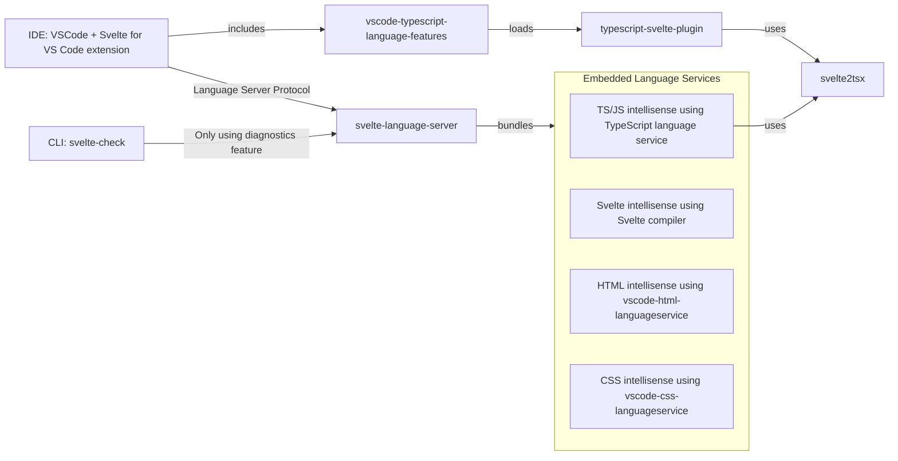

<p>
  <a href="https://svelte.dev">
	
  </a>

  <a href="https://www.npmjs.com/package/svelte">
    
  </a>

  <a href="https://github.com/sveltejs/svelte/blob/master/LICENSE">
    
  </a>
</p>

[IDE docs and troubleshooting](docs)

## What is Svelte Language Tools?

Svelte Language Tools contains a library implementing the Language Server Protocol (LSP). LSP powers the [VSCode extension](https://marketplace.visualstudio.com/items?itemName=svelte.svelte-vscode), which is also hosted in this repository. Additionally, LSP is capable of powering plugins for [numerous other IDEs](https://microsoft.github.io/language-server-protocol/implementors/tools/).

A `.svelte` file would look something like this:

```html
<script>
    let count = 1;

    // the `$:` means 're-run whenever these values change'
    $: doubled = count * 2;
    $: quadrupled = doubled * 2;

    function handleClick() {
        count += 1;
    }
</script>

<button on:click="{handleClick}">Count: {count}</button>

<p>{count} * 2 = {doubled}</p>
<p>{doubled} * 2 = {quadrupled}</p>
```

Which is a mix of [HTMLx](https://github.com/htmlx-org/HTMLx) and vanilla JavaScript (but with additional runtime behavior coming from the svelte compiler).

This repo contains the tools which provide editor integrations for Svelte files like this.

## Packages

This repo uses [`pnpm workspaces`](https://pnpm.io/workspaces/), which TLDR means if you want to run a commands in each project then you can either `cd` to that directory and run the command, or use `pnpm -r [command]`.

For example `pnpm -r test`.

#### [`svelte-language-server`](packages/language-server)

The language server for Svelte. Built from [UnwrittenFun/svelte-language-server](https://github.com/UnwrittenFun/svelte-language-server) and heavily inspired by [Vetur](https://github.com/vuejs/vetur) to become the official language server for the language.

#### [`svelte-check`](packages/svelte-check)

A command line tool to check your svelte files for type errors, unused css, and more. Built from [Vetur's VTI](https://github.com/vuejs/vetur/tree/master/vti).

#### [`svelte-vscode`](packages/svelte-vscode)

The official vscode extension for Svelte. Built from [UnwrittenFun/svelte-vscode](https://github.com/UnwrittenFun/svelte-vscode) to become the official vscode extension for the language.

#### [`svelte2tsx`](packages/svelte2tsx)

Converts a .svelte file into a legal TypeScript file. Built from [halfnelson/svelte2tsx](https://github.com/halfnelson/svelte2tsx) to provide the auto-complete and import mapping inside the language server.

> Want to see how it's transformed? [Check out this REPL](https://embed.plnkr.co/plunk/JPye9tlsqwMrWHGv?show=preview&autoCloseSidebar)

## Development

### High Level Overview



More information about the internals can be found [HERE](./docs/internal/overview.md).

#### Setup

Pull requests are encouraged and always welcome. [Pick an issue](https://github.com/sveltejs/language-tools/issues?q=is%3Aissue+is%3Aopen+sort%3Aupdated-desc) and help us out!

To install and work on these tools locally:

> Make sure to uninstall the extension from the marketplace to not have it clash with the local one.

```bash
git clone https://github.com/sveltejs/language-tools.git svelte-language-tools
cd svelte-language-tools
pnpm install
pnpm bootstrap
```

> Do not use npm to install the dependencies, as the specific package versions in `pnpm-lock.yaml` are used to build and test Svelte.

To build all of the tools, run:

```bash
pnpm build
```

The tools are written in [TypeScript](https://www.typescriptlang.org/), but don't let that put you off — it's basically just JavaScript with type annotations. You'll pick it up in no time. If you're using an editor other than [Visual Studio Code](https://code.visualstudio.com/) you may need to install a plugin in order to get syntax highlighting and code hints etc.

#### Making Changes

There are two ways to work on this project: either by working against an existing project or entirely through tests.

## Running the Dev Language Server Against Your App

To run the developer version of both the language server and the VSCode extension:

-   open the root of this repo in VSCode
-   Go to the debugging panel
-   Make sure "Run VSCode Extension" is selected, and hit run

This launches a new VSCode window and a watcher for your changes. In this dev window you can choose an existing Svelte project to work against. If you don't use pure Javascript and CSS, but languages like Typescript or SCSS, your project will need a [Svelte preprocessor setup](docs#using-with-preprocessors). When you make changes to the extension or language server you can use the command "Reload Window" in the VSCode command palette to see your changes. When you make changes to `svelte2tsx`, you first need to run `pnpm build` within its folder.

### Running Tests

You might think that as a language server, you'd need to handle a lot of back and forth between APIs, but actually it's mostly high-level JavaScript objects which are passed to the [npm module vscode-languageserver](https://code.visualstudio.com/api/language-extensions/language-server-extension-guide).

This means it's easy to write tests for your changes:

```bash
pnpm test
```

For tricker issues, you can run the tests with a debugger in VSCode by setting a breakpoint (or adding `debugger` in the code) and launching the task: "Run tests with debugger".

## Supporting Svelte

Svelte is an MIT-licensed open source project with its ongoing development made possible entirely by the support of awesome volunteers. If you'd like to support their efforts, please consider:

-   [Becoming a backer on Open Collective](https://opencollective.com/svelte).

Funds donated via Open Collective will be used for compensating expenses related to Svelte's development such as hosting costs. If sufficient donations are received, funds may also be used to support Svelte's development more directly.

## License

[MIT](LICENSE)

## Credits

-   [James Birtles](https://github.com/jamesbirtles) for creating the foundation which this language server, and the extensions are built on
-   Vue's [Vetur](https://github.com/vuejs/vetur) language server which heavily inspires this project
-   [halfnelson](https://github.com/halfnelson) for creating `svelte2tsx`
-   [jasonlyu123](https://github.com/jasonlyu123) for his ongoing work in all areas of the language-tools
